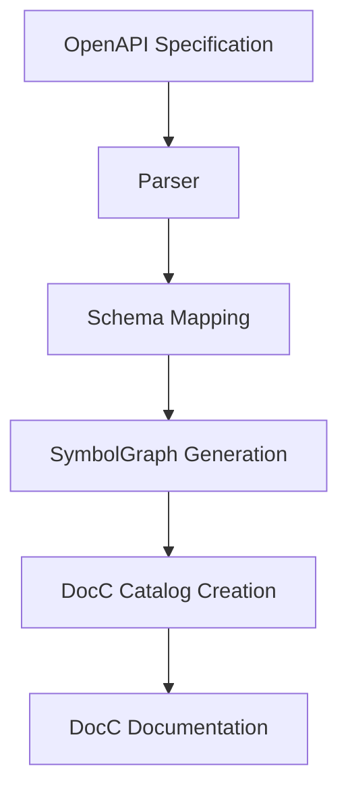
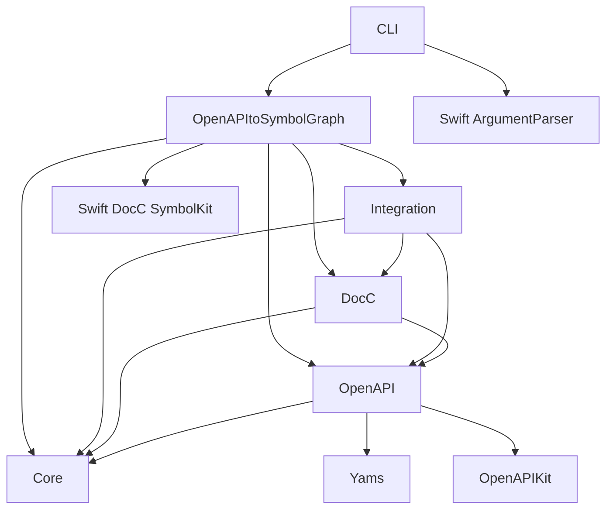

# Architecture Overview

This document outlines the architecture of the OpenAPI Integration with DocC project, explaining how the various components interact to convert OpenAPI specifications into DocC documentation.

## System Architecture

The OpenAPI Integration with DocC system follows a pipeline architecture with distinct processing stages:



### Key Stages

1. **Parsing**: Reading and parsing OpenAPI specifications (YAML/JSON)
2. **Schema Mapping**: Converting OpenAPI schemas to Swift types
3. **SymbolGraph Generation**: Creating SymbolKit symbols and relationships
4. **DocC Catalog Creation**: Generating a DocC catalog with documentation files
5. **Documentation Rendering**: Processing with DocC to create the final documentation

## Project Structure

The project is organized into modular components, each responsible for a specific aspect of the conversion process:

```
OpenAPI-Integration-with-DocC/
├── Sources/
│   ├── CLI/                      # Command-line interface
│   ├── Core/                     # Core types and utilities
│   ├── OpenAPI/                  # OpenAPI parsing and models
│   │   ├── Models/               # OpenAPI data models
│   │   └── Parsers/              # YAML and JSON parsers
│   ├── DocC/                     # DocC integration
│   │   ├── Generators/           # Symbol graph generators
│   │   └── Renderers/            # Documentation renderers
│   ├── Integration/              # Integration layer
│   └── OpenAPItoSymbolGraph/     # Main conversion logic
│       ├── Mapping/              # Schema to symbol mapping
│       └── Utils/                # Utility functions
├── Examples/                     # Example OpenAPI specifications
├── Tests/                        # Test suite
└── Documentation/                # Project documentation
```

## Component Descriptions

### CLI (Command-Line Interface)

The CLI component provides the command-line interface for the tool, using Swift ArgumentParser to handle command-line arguments and options.

**Key Files:**
- `main.swift`: Entry point for the command-line tool
- `CLIHelpers.swift`: Helper functions for CLI operations

**Responsibilities:**
- Parsing command-line arguments
- Validating input files and options
- Coordinating the conversion process
- Error handling and reporting

### Core

The Core module contains fundamental types and utilities used throughout the project.

**Key Files:**
- `HttpMethod.swift`: Enumeration of HTTP methods
- `Mapping.swift`: Base mapping protocols and utilities

**Responsibilities:**
- Providing shared types and protocols
- Defining interfaces for mapping operations

### OpenAPI

The OpenAPI module handles parsing OpenAPI specifications and provides models for representing the OpenAPI structure.

**Key Files:**
- `Models/Document.swift`: Representation of an OpenAPI document
- `Models/Schema.swift`: Representation of JSON Schema elements
- `Parsers/YAMLParser.swift`: Parser for YAML OpenAPI specifications
- `Parsers/JSONParser.swift`: Parser for JSON OpenAPI specifications

**Responsibilities:**
- Parsing OpenAPI specifications from YAML or JSON
- Representing OpenAPI elements in Swift types
- Validating OpenAPI structures

### DocC

The DocC module handles integration with Swift's DocC documentation system.

**Key Files:**
- `Generators/SymbolGraphGenerator.swift`: Generates SymbolGraph files
- `Renderers/SymbolGraphRenderer.swift`: Renders documentation from SymbolGraphs

**Responsibilities:**
- Generating SymbolGraph files for DocC
- Creating DocC-compatible documentation structures
- Formatting documentation content

### Integration

The Integration module connects the OpenAPI models with the DocC generation process.

**Key Files:**
- `OpenAPIDocCConverter.swift`: Main converter between OpenAPI and DocC

**Responsibilities:**
- Providing the high-level API for conversion
- Coordinating between OpenAPI parsing and DocC generation

### OpenAPItoSymbolGraph

The OpenAPItoSymbolGraph module contains the core logic for converting OpenAPI schemas to SymbolKit symbols.

**Key Files:**
- `SymbolMapping.swift`: Maps OpenAPI schemas to SymbolKit symbols
- `OpenAPItoSymbolGraph.swift`: Main conversion logic
- `Utils/DocC/DocCCatalogGenerator.swift`: Generates DocC catalogs
- `Utils/OpenAPIKitExtensions.swift`: Extensions for OpenAPIKit compatibility

**Responsibilities:**
- Mapping OpenAPI schemas to Swift types
- Creating appropriate SymbolKit symbols
- Generating relationships between symbols
- Creating DocC catalog files

## Data Flow

The data flows through the system as follows:

1. **Input Processing**:
   - The CLI parses command-line arguments and options
   - The OpenAPI parser reads and parses the specification file

2. **Conversion**:
   - OpenAPI schemas are mapped to SymbolKit symbols
   - Relationships between symbols are established
   - Additional metadata is added to symbols

3. **Output Generation**:
   - SymbolGraph JSON is generated
   - DocC catalog files are created
   - Documentation structure is assembled

## Key Interfaces

### OpenAPIDocCConverter

The primary interface for converting OpenAPI documents to DocC documentation:

```swift
public struct OpenAPIDocCConverter {
    public init(moduleName: String? = nil, baseURL: URL? = nil)
    public func convert(_ document: Document) -> SymbolGraph
}
```

### SymbolMapping

The core interface for mapping OpenAPI schemas to SymbolKit symbols:

```swift
public struct SymbolMapping {
    public static func mapSchema(_ schema: JSONSchema,
                                name: String,
                                parentUsr: String,
                                moduleName: String) -> SymbolKit.SymbolGraph.Symbol
}
```

### DocCCatalogGenerator

Interface for generating DocC catalogs from OpenAPI documents:

```swift
public struct DocCCatalogGenerator {
    public init(moduleName: String? = nil,
                baseURL: URL? = nil,
                outputDirectory: URL,
                includeExamples: Bool = false)

    public func generateCatalog(from document: Document,
                                overwrite: Bool = false) throws -> URL
}
```

## Dependency Graph

The project has the following key dependencies:



## Design Patterns

The project employs several design patterns:

### Pipeline Pattern

The conversion process follows a pipeline pattern, with data flowing through distinct processing stages.

### Adapter Pattern

The project adapts OpenAPI schemas to SymbolKit symbols, bridging the gap between these different systems.

### Factory Pattern

Factory methods create different kinds of symbols based on the OpenAPI schema types.

### Visitor Pattern

The schema mapping logic visits different parts of the OpenAPI structure to build the corresponding symbol graph.

## Extension Points

The architecture supports several extension points:

### Custom Type Mappings

You can extend the `SymbolMapping` struct to add custom type mappings for specific OpenAPI schemas.

### Custom Documentation Templates

The documentation generation process can be customized by modifying the templates in `DocCCatalogGenerator`.

### Additional Parsers

The parser system can be extended to support additional formats or versions of OpenAPI specifications.

## Performance Considerations

The architecture addresses performance in several ways:

### Lazy Parsing

OpenAPI specifications are parsed lazily when possible, to avoid loading unnecessary data.

### Memory Management

Large OpenAPI specifications are processed efficiently to minimize memory usage.

### Parallelization

Some operations, such as schema processing, could be parallelized for better performance with large specifications.

## Future Directions

The architecture is designed to support future enhancements:

1. **Expanded OpenAPI Support**: Adding support for more OpenAPI features and versions
2. **Custom DocC Templates**: Allowing users to provide custom DocC templates
3. **Integration with Build Systems**: Better integration with Swift Package Manager and other build systems
4. **Incremental Documentation**: Supporting incremental updates to documentation based on API changes

## Conclusion

The OpenAPI Integration with DocC project follows a modular, pipeline-based architecture that separates concerns while providing a flexible system for converting OpenAPI specifications to DocC documentation. This design allows for extensibility, maintainability, and future enhancements.
